# PX Stream [WIP]

> PX Stream is a visual performance toolkit for [Max for Live](https://www.ableton.com/en/live/max-for-live/),
> featuring audio-reactive [Interactive Shader Format](https://www.interactiveshaderformat.com/) visuals,
> text rendering and [Syphon](https://syphon.info/) output streaming


## Devices / Usage

**Core**

- [PX World](#px-world)
- [PX Mix View](#px-mix-view)
- [PX Mix Channel](#px-mix_channel)
- [PX Mix Dry](#px-mix-dry)
- [PX Shader](#px-shader)
- [PX Transform](#px-transform)
- [PX Route Audio](#px-route-audio)
- [PX Route MIDI](#px-route-midi)

**Inputs FX**

- [PX IN Text](#px-in-text)
- [PX IN Cam](#px-in-cam)
- [PX IN Channel](#px-in-channel)
- [PX IN Cos Pattern](#px-in-cos-pattern)
- [PX IN Mix](#px-in-mix)
- [PX IN SVG](#px-in-svg)
- [PX IN Syphon](#px-in-syphon)

**Effects FX**

- [PX FX Blur](#px-fx-blur)
- [PX FX Color](#px-fx-color)
- [PX FX Colorize](#px-fx-colorize)
- [PX FX Convert](#px-fx-convert)
- [PX FX Delay](#px-fx-delay)
- [PX FX Kaleidoscope](#px-fx-kaleidoscope)
- [PX FX Pass](#px-fx-pass)

**Development utilities DEV**

- [DEV Info](#dev-info)
- [DEV Console](#dev-console)

### PX World

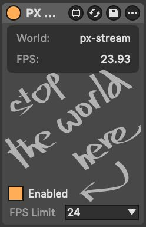 _v1.jpg)

### PX Mix View

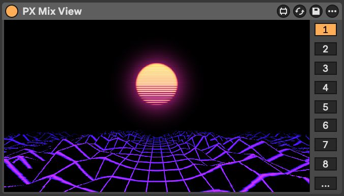
_v1.jpg)

### PX Mix_Channel

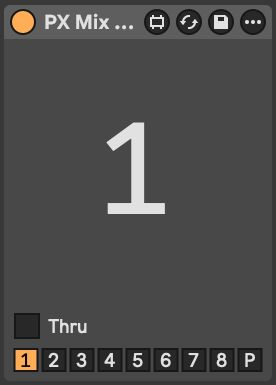

### PX Mix Dry

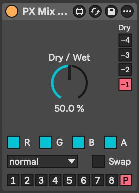

### PX Shader

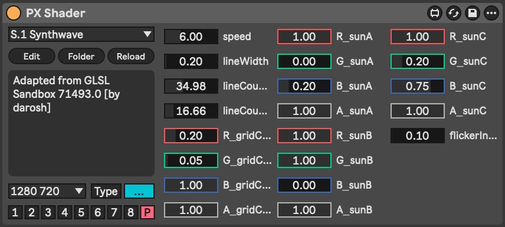
_v1.jpg)

### PX Transform


### PX Route Audio

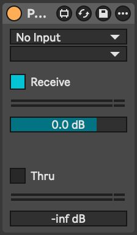

### PX Route MIDI

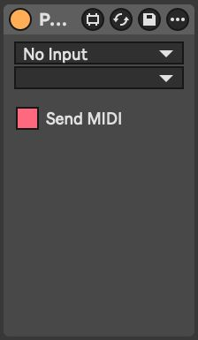
_v1.jpg)

### PX IN Text

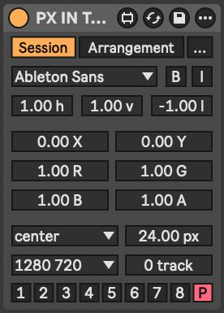
_v1.jpg)

### PX IN Cam

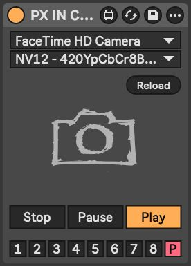

### PX IN Channel

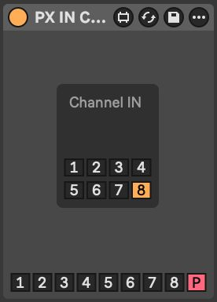

### PX IN Cos Pattern


### PX IN Mix

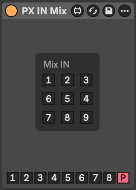

### PX IN SVG

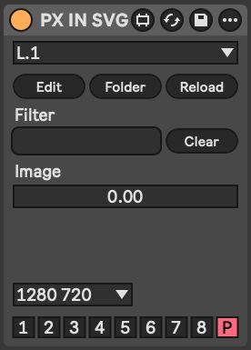

### PX IN Syphon

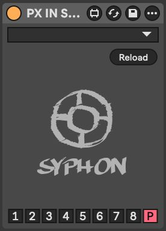

### PX FX Blur

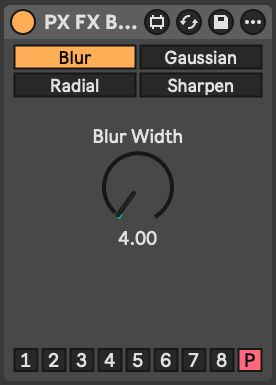

### PX FX Color

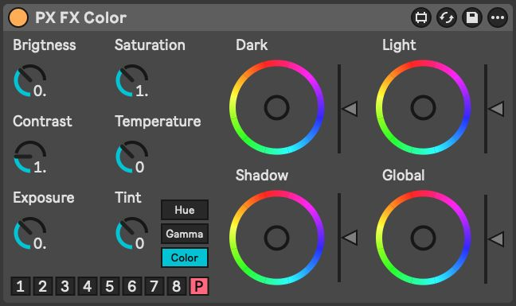
_v1.jpg)
_v1.jpg)

### PX FX Colorize

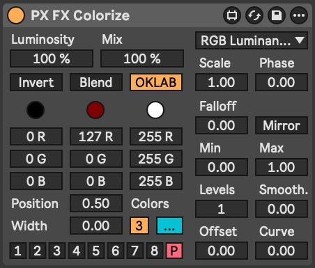

### PX FX Convert

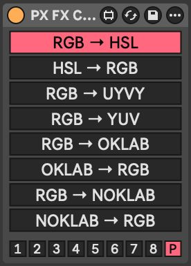
_v1.jpg)

### PX FX Delay


### PX FX Kaleidoscope


### PX FX Pass

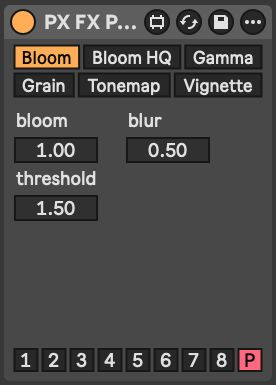

### DEV Info

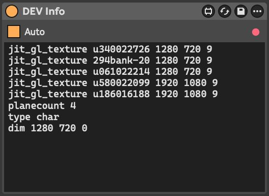

### DEV Console


## Development

### Prerequisites

- install __"ISF by Vidvox"__ in Max `File > Show Package Manager`
- configure [maxdiff](https://github.com/Ableton/maxdevtools/tree/main/maxdiff)

### Diff

```bash
git --no-pager diff "./*.amxd" "./*.maxpat"
```

### Shaders

- shaders loaded from `./shaders` folder near the device
- do not use keywords (like `size`, `float`, `int`, ...) in ISF `NAME` property

### ISF Extensions

|      | Name       | Type     | Description                                                                                                                                                                                           |
|------|------------|----------|-------------------------------------------------------------------------------------------------------------------------------------------------------------------------------------------------------|
| WAVE | waveImage  | audio    | standard ISF, channel per image row                                                                                                                                                                   |
| WAVU | wavuImage  | audio    | channel per image color, Red = Left, Green = Right                                                                                                                                                    |
| FFT  | fftImage   | audiofft | standard ISF, channel per image row                                                                                                                                                                   |
| FFTU | fftuImage  | audiofft | channel per image color                                                                                                                                                                               |
| XY   | xyImage    | audio    | X = Left, Y = Right, dots                                                                                                                                                                             |
| XYC  | xycImage   | audio    | X = Left, Y = Right, connected lines                                                                                                                                                                  |
| XYD  | xydImage   | audio    | X = Left, Y = Right, skipping distant lines                                                                                                                                                           |
| XYE  | xyeImage   | audio    | [electron beam emulation](https://m1el.github.io/woscope-how/), ported to Jitter shader by Rob Ramirez [here](https://discord.com/channels/289378508247924738/351004699811512322/1407790819183956109) |
| MIDI | midiImage  | audio    | X = (R: note/velocity, G: CC number/value), Y = MIDI channel                                                                                                                                          |
| IN   | inputImage | image    | automatic, from previous device in the chain                                                                                                                                                          |

## Shaders [TBD]

### C. Colorful

### F. FFT Spectrogram

### G. Generator

### L. LED

### M. MIDI

### S. Scenes

### T. Transformation

### U. Utility

### W. Waveforms

### X. XY Oscilloscopes

### ~. Test Shaders

## Alternatives

- [VIZZable 2](https://github.com/zealtv/VIZZable-2) (free)
- [Geometrum 02](https://artekniks.gumroad.com/l/geometrum) (free)
- [Videosync 2](https://videosync.showsync.com/)
- [EboSuite](https://www.ebosuite.com/)
- [VS - Visual Synthesizer](https://www.imaginando.pt/products/vs-visual-synthesizer)
- [Zwobot](https://www.zwobotmax.com/)
