# PX Stream

⚠️ `WARNING` Work in progress. Not ready for use. Stay tuned.

  

> PX Stream is a visual performance toolkit of 30+ devices for [Max for Live](https://www.ableton.com/en/live/max-for-live/), featuring 
> - audio-reactive [Interactive Shader Format](https://www.interactiveshaderformat.com/) visuals, 
> - various effects, generators and utilities,
> - 90+ transitions
> - text rendering 
> - and [Syphon](https://syphon.info/)/[Spout](https://spout.zeal.co/) output streaming

  

<!-- begin: collage -->

    <a href="#px-mix-view">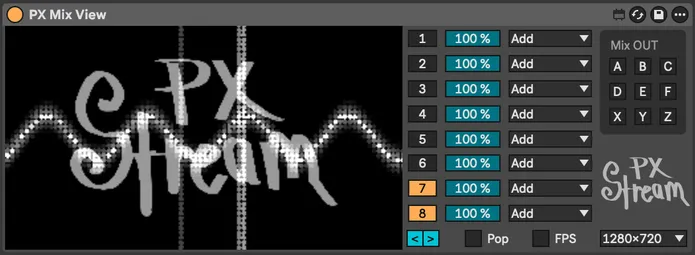</a>
    <a href="#fx-colorize">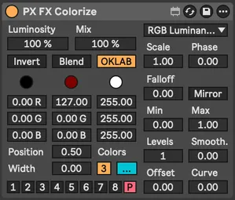</a>
    <a href="#in-stream">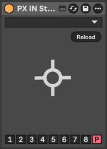</a>
    <a href="#in-image">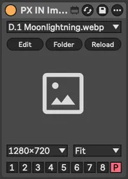</a>
    <a href="#fx-pass">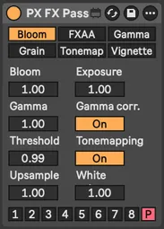</a>
    <a href="#dev-console">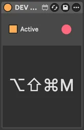</a>
    <a href="#px-shader">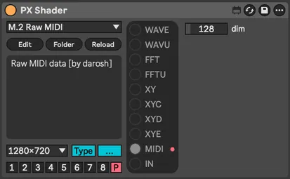</a>
    <a href="#fx-pixelization">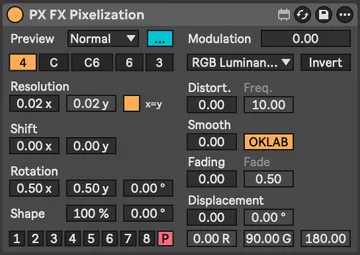</a>
    <a href="#fx-alpha">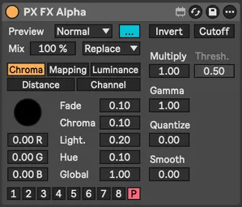</a>
    <a href="#px-route-audio">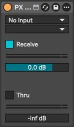</a>
    <a href="#in-channel">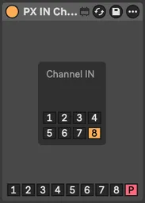</a>
    <a href="#fx-kaleidoscope">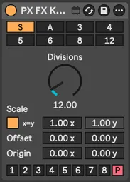</a>
    <a href="#px-world">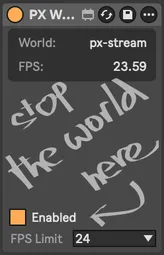</a>
    <a href="#px-rec">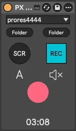</a>
    <a href="#px-shader">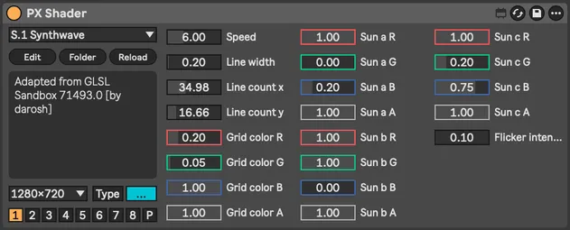</a>
    <a href="#fx-color">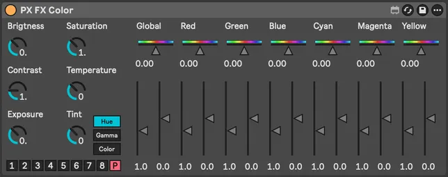</a>
    <a href="#gen-mini-shader">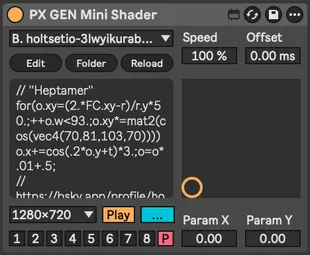</a>
    <a href="#px-world">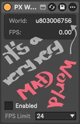</a>
    <a href="#px-route-midi">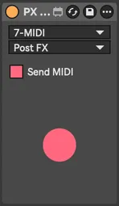</a>
    <a href="#fx-transform">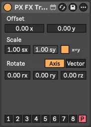</a>
    <a href="#fx-blur">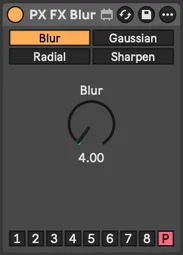</a>
    
    <a href="#gen-sketching">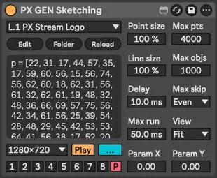</a>
    <a href="#fx-color">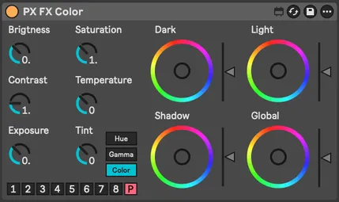</a>
    <a href="#gen-text">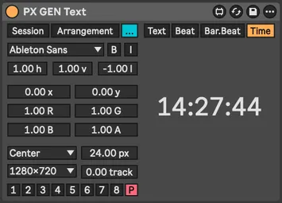</a>
    <a href="#px-mix-dry">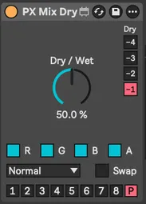</a>
    <a href="#in-svg">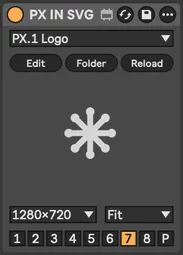</a>
    <a href="#gen-text">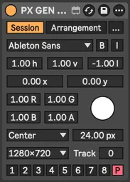</a>
    <a href="#fx-convert">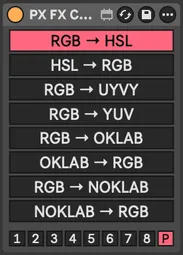</a>
    <a href="#in-mix">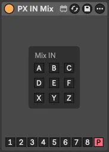</a>
    <a href="#gen-cos-pattern">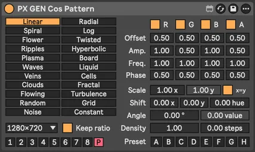</a>
    <a href="#fx-color">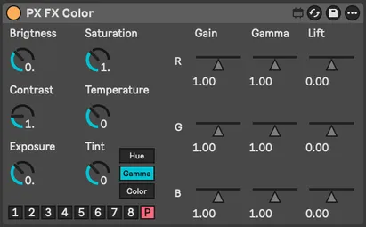</a>
    <a href="#px-mix-channel">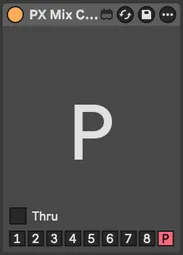</a>
    <a href="#fx-delay">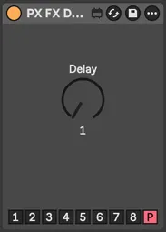</a>
    <a href="#in-cam">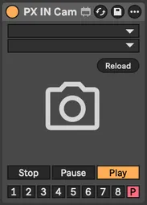</a>
    <a href="#in-stream">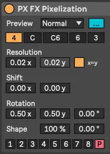</a>
    <a href="#px-mix-transition">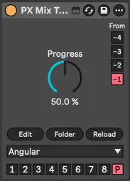</a>
    <a href="#dev-info">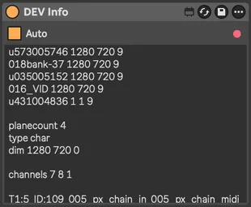</a>
    <a href="#px-mix-view">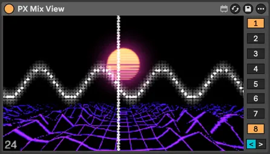</a>

<!-- end: collage -->

 

- [Install](#install)
- [Troubleshooting and feedback](#troubleshooting-and-feedback)
- [Guide](#guide)
    - [Minimal patch](#guide--minimal-patch)
    - [Adding FX](#guide--adding-fx)
    - [Using Mix Dry](#guide--using-mix-dry)
    - [Syphon streaming](#guide--using-mix-dry)
    - [Automation](#guide--automation)
    - [Transitions](#guide--performance)
- [Devices](#devices)
- [Alternatives](#alternatives)
- [Roadmap](#roadmap)
- [License](#license)

 

## Install

0. Prerequisites: _Ableton Live 12 Suite_ or _Ableton Live 12 Standard with Max for Live_
1. Download latest [release](https://github.com/darosh/px-stream/releases)
2. Follow official instructions on [Using third-party Packs](https://help.ableton.com/hc/en-us/articles/206471044-Using-third-party-Packs)

### Windows

Windows users need to install two additional Max packages (VIDDLL and [ISF](https://cycling74.com/packages/isf)) in [package manager](https://docs.cycling74.com/userguide/package_manager/)

Open the package manager:

1. Open [...] menu on max device, for example `PX World` and click `Edit in Max`
2. In Max > `File` menu click `Show Package Manager`

In package manager:

4. Select `Remote packages` and search for a package `VIDDLL`
5. Open the package and click install
6. Repeat step **4.** for `ISF` package
7. Restart Live

 

## Troubleshooting and feedback

- File an [issue](https://github.com/darosh/px-stream/issues) or vote on existing one
- Join our [Discord server](https://discord.gg/de5txQSven)

 

## Guide

### Guide &mdash; Minimal patch

1. Insert [PX World](#px-world) device
2. Insert [PX Mix View](#px-mix-view) device
3. Insert [GEN Mini Shader](#gen-mini-shader) device
4. Select channel number **1** in `channel selector` in the bottom of the last inserted device

✨ `TIP`  All devices start with PX so you can quickly select device with sequence <kbd>Command+F</kbd> + `px wo` + <kbd>Down</kbd> + <kbd>Enter</kbd>

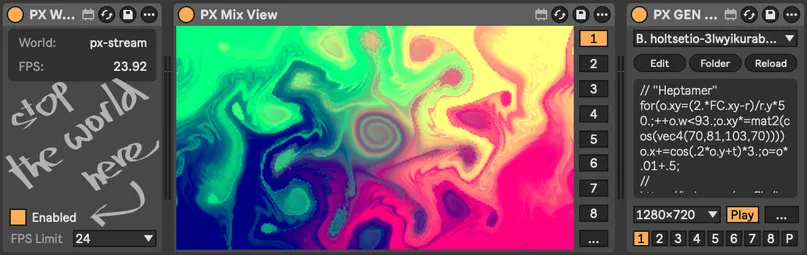

 

### Guide &mdash; Adding FX

1. Select **P** (Pass) in `channel selector` in the `GEN Mini Shader` device from previous guide
2. Insert [FX Kaleidoscope](#fx-kaleidoscope) device
3. Insert [PX Mix Channel](#px-mix-channel) device
4. Select **1** in `channel selector in the bottom of the last inserted device
5. Adjust FX Kaleidoscope parameters as you like

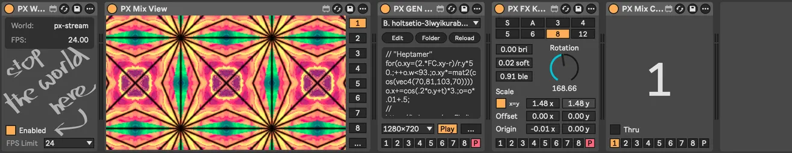

 

### Guide &mdash; Using Mix Dry

1. Insert [IN SVG](#in-svg) device before `Mix Channel` device and select `PX Stream logo`
2. Insert [PX Mix Dry](#px-mix-dry) before `Mix Channel` device
3. Experiment with parameters in the `Mix Dry` device

✨ `TIP`  `Dry` selector **-1** to **-4** in the `PX Mix Dry` device selects which of the previous devices is used as the _dry_ one

✨ `TIP`  With [PX Mix Channel](#px-mix-channel) and [PX Mix Dry](#px-mix-dry) you can create complex multichannel non-linear processing structure in single track

 

### Guide &mdash; Syphon streaming

1. Expand the [PX Mix View](#px-mix-view) device using the `[...]` button
2. Select Mix OUT channel number **1** &dash; this will allow you to select the stream in Syphon client as `[Live] PX Stream 1`

📒 `NOTE` `Mix OUT` has dual purpose, not only it turns the Syphon output on, but it also can be consumed with the [IN Mix](#in-mix) device for further (post)processing

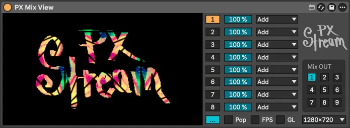

 

### Guide &mdash; Automation

Most of the 500+ parameters in the toolkit can be [automated in standard way](https://www.ableton.com/en/manual/automation-and-editing-envelopes/) with few exceptions:

- **File and font menus** in devices loading dynamic assets operate on two ways
  1. when you only select single value without automation the session will restore the value based on selected name
  2. when you automate, for example `File / File Automation` parameter in [IN SVG](#in-svg) the automation is based on order of items and will break if you change the content of loaded folder, for example `assets/svg`
- **Color wheels** in [FX Color](#fx-color) &mdash; see  🧲 `AUTOMATION` note in the device documentation

 

### Guide &mdash; Performance

- Devices and assets are designed to be mostly lightweight and run at 60 to 120 FPS on MacBook M1 Pro.
- Power status, energy saving options and floating/fullscreen preview window status may affect real FPS.
- Most of the processing is done with OpenGL on GPU so they should not affect Ableton CPU based sound processing.
- Optimizing resources loaded from assets is recommended: smaller dimensions for images and smaller format (WEBP) and smaller dimensions and CPU friendly codec (HAP) for videos
- Some devices, especially the postprocessing ones like the [FX Pass](#fx-pass) is better to use only once &mdash; before the final output

✨ `TIP` To guess the impact of device on performance select 0 FPS in [PX World](#px-world) and turn on the `Show FPS` switch in extended (`[...]` button) [PX Mix View](#px-mix-view) device

 

## Devices

<table>
  <tr>
    <th align="left">PX Core</th>
    <th align="left">IN (inputs)</th>
    <th align="left">GEN (generators)</th>
    <th align="left">FX (effects)</th>
    <th align="left">DEV (utilities)</th>
  </tr>
    <td valign="top">
        <a href="#px-world">World</a> 
        <a href="#px-mix-view">Mix View</a> 
        <a href="#px-mix_channel">Mix Channel</a> 
        <a href="#px-mix-dry">Mix Dry</a> 
        <a href="#px-mix-transition">Mix Transition</a> 
        <a href="#px-rec">Rec</a> 
        

        <a href="#px-route-audio">Route Audio</a> 
        <a href="#px-route-midi">Route MIDI</a> 
        

        <a href="#px-shader">Shader</a>
    </td>
    <td valign="top">
        <a href="#in-cam">IN Cam</a> 
        <a href="#in-stream">IN Stream</a> 
        

        <a href="#in-image">IN Image</a> 
        <a href="#in-video">IN Video</a> 
        <a href="#in-svg">IN SVG</a> 
        

        <a href="#in-channel">IN Channel</a> 
        <a href="#in-mix">IN Mix</a> 
    </td>
    <td valign="top">
        <a href="#gen-cos-pattern">GEN Cos Pattern</a> 
        <a href="#gen-mini-shader">GEN Mini Shader</a> 
        <a href="#gen-sketching">GEN Sketching</a> 
        <a href="#gen-text">GEN Text</a> 
    </td>
    <td valign="top">
        <a href="#fx-alpha">FX Alpha</a> 
        <a href="#fx-blur">FX Blur</a> 
        <a href="#fx-color">FX Color</a> 
        <a href="#fx-colorize">FX Colorize</a> 
        <a href="#fx-convert">FX Convert</a> 
        <a href="#fx-delay">FX Delay</a> 
        <a href="#fx-kaleidoscope">FX Kaleidoscope</a> 
        <a href="#fx-pass">FX Pass</a> 
        <a href="#fx-pixelization">FX Pixelization</a> 
        <a href="#fx-transform">FX Transform</a>
    </td>
    <td valign="top">
        <a href="#dev-info">DEV Info</a> 
        <a href="#dev-console">DEV Console</a>
    </td>
  </tr>
</table>

 

### PX World

Essential rendering context. You need exactly one per Live set. More would be problematic. Sets target FPS. FPS 0 will use available maximum with displaylink turned on on Mac.

 

 

---
 

### PX Mix View

Multichannel mixing and preview. Mix output selected in expanded section can be consumed by [IN Mix](#in-mix) device and [Syphon](https://syphon.info/) clients. Click preview for floating window, <kbd>ESC</kbd> for fullscreen on/off.

  

🎛️ `Hotkeys` 
- <kbd>Shift+Click</kbd> for instant screenshot stored in `assets/images`, it will be available in [IN Image](#in-image) device as PNG file
- <kbd>Control+Click</kbd> for instant video recording (while holding the mouse button) stored in `assets/video`, it will be available in [IN Video](#in-video) device as MOV file. For more control and automation use [PX Rec](#px-rec) device instead.

✨ `TIP` Click on preview opens floating window with fullscreen option and channel toggle buttons

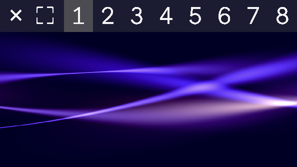

 

---
 

### PX Mix Channel

Send texture to selected channel. Alternative to individual channel selectors on each device.

 

---
 

### PX Mix Dry

Dry/wet mix from two previous devices. Select which (-1 to -4) for dry signal. Multiple blend modes and signal swap. Swap has no effect on [commutative](https://en.wikipedia.org/wiki/Commutative_property) blending methods.

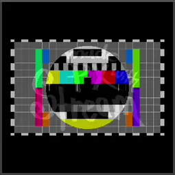 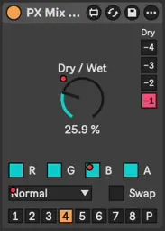

 

---
 

### PX Mix Transition

Transition between two previous devices. Channel selection same as Mix Dry. Uses 90+ transitions from [gl-transitions.com](https://gl-transitions.com/).

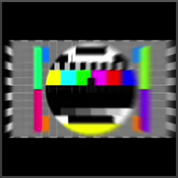 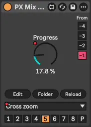

 

---
 

### PX Rec

Video recording and screenshotting

✨ `TIP`  Recorded files are stored under `assets/video` as MOV files and directly available in [IN Video](#in-video) device and for screenshot it is PNG files in `assets/images` and [IN Image](#in-image) device

 

---
 

### PX Route Audio

Route audio from any track in your Live set

 

---
 

### PX Route MIDI

Send MIDI from selected track to next device. Works with [PX Shader](#px-shader) device and MIDI-enabled shaders.

 

---
 

### PX Shader

Interactive Shader Format ([ISF](https://isf.video/)) host for generators and effects. Up to 32 dynamic parameters and various audio rendering options with our custom audio types.

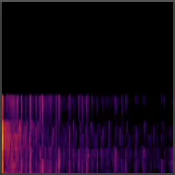   

🧲 `AUTOMATION` To automate selected shader file find `File` / `File Automation` parameter in automation lane

#### PX Shader &mdash; Audio types

|      | Name       | Type     | Description                                                                                                                                                                                           |
|------|------------|----------|-------------------------------------------------------------------------------------------------------------------------------------------------------------------------------------------------------|
| WAVE | waveImage  | audio    | standard ISF, channel per image row                                                                                                                                                                   |
| WAVU | wavuImage  | audio    | channel per image color, Red = Left, Green = Right                                                                                                                                                    |
| FFT  | fftImage   | audiofft | standard ISF, channel per image row                                                                                                                                                                   |
| FFTU | fftuImage  | audiofft | channel per image color                                                                                                                                                                               |
| XY   | xyImage    | audio    | X = Left, Y = Right, dots                                                                                                                                                                             |
| XYC  | xycImage   | audio    | X = Left, Y = Right, connected lines                                                                                                                                                                  |
| XYD  | xydImage   | audio    | X = Left, Y = Right, skipping distant lines                                                                                                                                                           |
| XYE  | xyeImage   | audio    | [electron beam emulation](https://m1el.github.io/woscope-how/), ported to Jitter shader by Rob Ramirez [here](https://discord.com/channels/289378508247924738/351004699811512322/1407790819183956109) |
| MIDI | midiImage  | audio    | X = (R: note/velocity, G: CC number/value), Y = MIDI channel                                                                                                                                          |
| IN   | inputImage | image    | automatic, from previous device in the chain                                                                                                                                                          |

#### PX Shader &mdash; Shader categories

- C. Colorful
- F. FFT Spectrogram
- G. Generator
- L. LED
- M. MIDI
- S. Scenes
- T. Transformation
- U. Utility
- W. Waveforms
- X. XY Oscilloscopes
- ~. Test Shaders

 

---
 

### IN Cam

Live input from connected video devices

 

---
 

### IN Stream

[Syphon](https://syphon.info/) or [Spout](https://spout.zeal.co/) input for sharing visuals between applications.

 

 

---
 

### IN Image

Static image input. Supports JPG, WEBP and PNG formats.

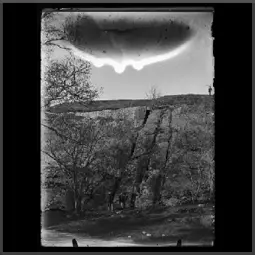 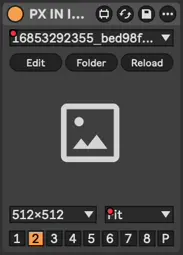

🧲 `AUTOMATION` To automate selected image file find `File` / `File Automation` parameter in automation lane

 

---
 

### IN SVG

Vector graphics input with resolution-independent scaling SVG file formal

 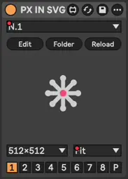

🧲 `AUTOMATION` To automate selected SVG file find `File` / `File Automation` parameter in automation lane

 

---
 

### IN Video

Video playback. Supports MP4, AVI, MOV (including [HAP codecs](https://hap.video/)).

 

🧲 `AUTOMATION` To automate selected video file find `File` / `File Automation` parameter in automation lane

 

---
 

### IN Channel

Use texture from [Mix Channel](#px-mix-channel) as input. Creates feedback when combined with [Mix Dry](#px-mix-dry) on same channel.

 

---
 

### IN Mix

Use channel mix from [Mix View](#px-mix-view) device as input texture.

 

---
 

### GEN Cos Pattern

Procedural patterns with cosine palettes [popularized](https://iquilezles.org/articles/palettes/) by Inigo Quilez

 

 

---
 

### GEN Mini Shader

Shaders in [twigl.app](https://twigl.app/) `geekest (300 es)` format.

 

🧲 `AUTOMATION` To automate selected mini shader find `File` / `File Automation` parameter in automation lane

#### GEN Mini Shader &mdash; Shader files

`GLSL` files are stored in `data/mini-shaders` folder. Temporary JXS files is stored under `data/mini-shaders/.temp.jxs`.

#### GEN Mini Shader &mdash; Shader categories

| Type | Description           |
|------|-----------------------|
| B.   | Shaders from Blue Sky |
| T.   | Shaders from Twitter  |
| X.   | Examples              |

Learn more about the [Modeling the World in 280 Characters](https://tympanus.net/codrops/2025/06/23/modeling-the-world-in-280-characters/).

#### GEN Mini Shader &mdash; Variables

| Name | Type      | Description  |
|------|-----------|--------------|
| FC   | vec4      | gl_FragCoord |
| r    | vec2      | resolution   |
| m    | vec2      | mouse        |
| t    | float     | time         |
| f    | float     | frame        |
| b    | sampler2D | backbuffer   |
| o    | vec4      | output       |

#### GEN Mini Shader &mdash; Utilities

Dynamically included when referenced in mini shader GLSL.

- **Noise**: `F4`, `mod289`, `permute`, `taylorInvSqrt`, `snoise2D`, `snoise3D`, `grad4`, `snoise4D`, `fsnoise`, `fsnoiseDigits`
- **Color**: `hsv`
- **Rotation**: `rotate2D`, `rotate3D`
- **Constants**: `PI`, `PI2`
- **Compatibility**: `tanh` (`#define tanh(x) tanh(clamp(x, -10.,10.))`)

Learn more in [twigl documentation](https://github.com/doxas/twigl#twigl).

 

---
 

### GEN Sketching

Custom OpenGL primitives scripting with JavaScript, slightly compatible with [openprocessing.org](https://openprocessing.org/)

 

🧲 `AUTOMATION` To automate selected sketch find `File` / `File Automation` parameter in automation lane

🧪 `DEV_NOTE` This device is very limited, and due to the underlying tech `JS`/`jit.gl.sketch` it will likely develop into its own thing rather than processing.js compatible environment 

 

---
 

### GEN Text

Text generation from session/clip names, custom text, or dynamic musical data (beat, bar.beat, time)

  

🧲 `AUTOMATION` To automate selected font find `Font` / `Font Automation` parameter in automation lane

 

---
 

### FX Alpha

Alpha channel tools: chroma key, mapping, inversion, smoothing, removal, etc.

 

 

---
 

### FX Blur

Four blur shaders from Max/Jitter stock collection

 

 

---
 

### FX Color

Color grading and adjustment tools

    

🧲 `AUTOMATION` For color wheels automation find `Dark X`, `Dark Y`, `Light X`, ... parameters in automation lane 

✨ `TIP` To reset color wheel to default value click its label `Dark`, `Light`, ...

 

---
 

### FX Colorize

Two/tri tone colorization with multiple mapping methods

 

 

---
 

### FX Convert

Texture format conversion including OKLAB and normalized OKLAB aka NOKLAB

 

✨ `TIP` to get even weirder colors use two `FX Convert` devices with different format

 

---
 

### FX Delay

Frame-based texture delay. Combine with Mix Dry device for ghost trail effects.

 

✨ `TIP` To see the dry and delayed signal at same time put [Mix Dry](#px-mix-dry) device after the delay one

 

---
 

### FX Kaleidoscope

Kaleidoscope patterns based on [Brewster designs]((https://en.wikipedia.org/wiki/Kaleidoscope#Different_versions_suggested_by_Brewster)) plus Max/Jitter shader

 

 

---
 

### FX Pass

Postprocessing shaders from Max/Jitter stock library. See [Max documentation](https://docs.cycling74.com/reference/jit.gl.pass).

 

✨ `TIP` Everything looks better with Bloom effect, especially if you are into the neon glowing aesthetics.

✨ `TIP` To adjust Bloom effect find the right `Threshold` first and then set the `Bloom` amount

 

---
 

### FX Pixelization

Multi-shape pixelization: rectangular, circular, honeycomb, hexagonal, triangular grids

 

✨ `TIP` To make a gap between pixels lower the `Shape %` value

✨ `TIP` To make image less pixelated adjust the `Smooth` parameter

✨ `TIP` For LED like glowing effect use `Fading`

 

---
 

### FX Transform

Geometric transformations: scale, shift, rotation (around axis or vector)

 

 

---
 

### DEV Info

Shows texture info for development purposes

 

---
 

### DEV Console

Enables detailed Max console output for development and debugging. ⚠ DO NOT USE IN PRODUCTION!

 

## Alternatives

Max for Live

- [VIZZable 2](https://github.com/zealtv/VIZZable-2) (free)
- [V-Module](https://github.com/j74/V-Module-Max-for-Live-Video-Plugins) (free)
- [Geometrum 02](https://artekniks.gumroad.com/l/geometrum) (free)
- [Zwobot](https://www.zwobotmax.com/)
- [EboSuite](https://www.ebosuite.com/)

Max for Live + App

- [Videosync 2](https://videosync.showsync.com/)

VST

- [VS - Visual Synthesizer](https://www.imaginando.pt/products/vs-visual-synthesizer)

 

## Roadmap

- alpha testing (volunteers)
- more shaders, presets
- beta testing (public)
- more shaders, presets
- demo track
- 1.0 release
- gumroad.com for donations?
- more shaders, presets
- 2.0?
  - simple/instant audio/MIDI based modulation
  - geometry/scene based devices?
  - more GENs, FXs, shaders, presets
  - device template / SDK, dev doc?

 

## License

This project is dual-licensed under [MIT or CC-BY](./LICENSE) (your choice).

You may use, modify, and distribute this work under either license.

For dynamically loaded assets licensing see [assets/LICENSE.md](./assets/LICENSE.md)
