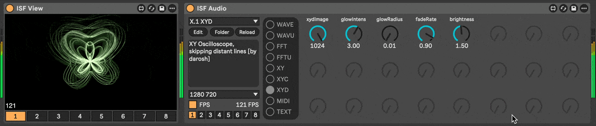

# ISF Audio [WIP]

> Interactive Shader Format ([IFS](https://www.interactiveshaderformat.com/)) audio [Syphon](https://syphon.info/) renderer, a [Max for Live](https://www.ableton.com/en/live/max-for-live/) device with support for `audio` and `audioFFT` IFS types


## Development

### Prerequisites

- install __"ISF by Vidvox"__ in Max `File > Show Package Manager`
- configure [maxdiff](https://github.com/Ableton/maxdevtools/tree/main/maxdiff)

### Diff

```bash
git --no-pager diff "./ISF Audio.amxd" "./param.maxpat"
```
### Shaders

- shaders loaded from `./shaders` folder near the device
- do not use keywords (like `size`, `float`, `int`, ...) in ISF `NAME` property

## Shaders [TBD]

### C. Colorful

### G. Spectrogram

### L. LED

### N. No Audio

### S. Scenes

### W. Waveforms

### X. XY Oscilloscopes

### ~. Test Shaders
