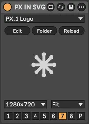
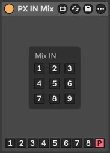
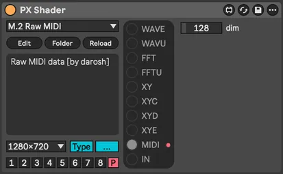
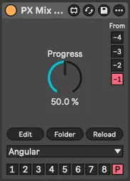
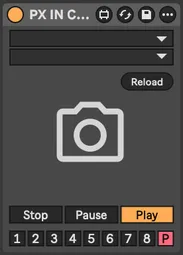
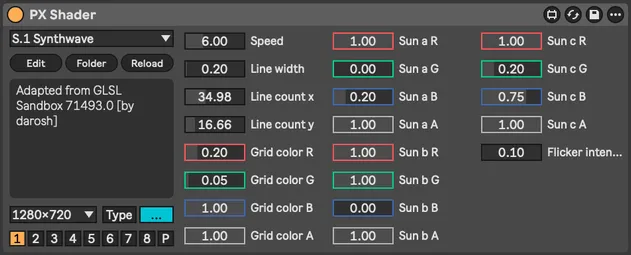
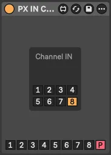

# PX Stream [WIP]

> PX Stream is a visual performance toolkit for [Max for Live](https://www.ableton.com/en/live/max-for-live/),
> featuring audio-reactive [Interactive Shader Format](https://www.interactiveshaderformat.com/) visuals,
> text rendering and [Syphon](https://syphon.info/) output streaming

- [Devices](#devices)
- [Development](#development)
- [Alternatives](#alternatives)

## Devices

<!-- begin: collage -->
<div>
    <a href="#px-mix-view"></a>
    <a href="#in-video"></a>
    <a href="#in-svg"></a>
    <a href="#gen-text"></a>
    <a href="#fx-convert"></a>
    <a href="#in-mix"></a>
    <a href="#fx-pixelization"></a>
    <a href="#px-shader"></a>
    <a href="#px-mix-transition"></a>
    <a href="#in-syphon"></a>
    <a href="#in-cam"></a>
    <a href="#fx-delay"></a>
    <a href="#px-mix-dry"></a>
    <a href="#fx-color"></a>
    <a href="#px-shader"></a>
    <a href="#fx-alpha"></a>
    <a href="#px-mix-channel"></a>
    <a href="#fx-transform"></a>
    <a href="#fx-convert"></a>
    <a href="#px-route-midi"></a>
    <a href="#dev-info"></a>
    <a href="#fx-color"></a>
    <a href="#fx-color"></a>
    <a href="#px-world"></a>
    <a href="#in-channel"></a>
    <a href="#fx-kaleidoscope"></a>
    <a href="#dev-console"></a>
    <a href="#gen-cos-pattern"></a>
    <a href="#gen-text"></a>
    <a href="#fx-colorize"></a>
    <a href="#px-world"></a>
    <a href="#in-image"></a>
    <a href="#fx-pass"></a>
    <a href="#fx-blur"></a>
    <a href="#px-route-audio"></a>
    <a href="#px-mix-view"></a>
</div>
<!-- end: collage -->

<br>

<table>
  <tr>
    <th align="left">PX Core</th>
    <th align="left">IN (inputs)</th>
    <th align="left">GEN (generators)</th>
    <th align="left">FX (effects)</th>
    <th align="left">DEV (utilities)</th>
  </tr>
    <td valign="top">
        <a href="#px-world">World</a><br>
        <a href="#px-mix-view">Mix View</a><br>
        <a href="#px-mix_channel">Mix Channel</a><br>
        <a href="#px-mix-dry">Mix Dry</a><br>
        <a href="#px-mix-transition">Mix Transition</a><br>
        <hr>
        <a href="#px-route-audio">Route Audio</a><br>
        <a href="#px-route-midi">Route MIDI</a><br>
        <hr>
        <a href="#px-shader">Shader</a>
    </td>
    <td valign="top">
        <a href="#in-cam">IN Cam</a><br>
        <a href="#in-syphon">IN Syphon</a><br>
        <hr>
        <a href="#in-image">IN Image</a><br>
        <a href="#in-video">IN Video</a><br>
        <a href="#in-svg">IN SVG</a><br>
        <hr>
        <a href="#in-channel">IN Channel</a><br>
        <a href="#in-mix">IN Mix</a><br>
    </td>
    <td valign="top">
        <a href="#gen-cos-pattern">GEN Cos Pattern</a><br>
        <a href="#gen-text">GEN Text</a><br>
    </td>
    <td valign="top">
        <a href="#fx-alpha">FX Alpha</a><br>
        <a href="#fx-blur">FX Blur</a><br>
        <a href="#fx-color">FX Color</a><br>
        <a href="#fx-colorize">FX Colorize</a><br>
        <a href="#fx-convert">FX Convert</a><br>
        <a href="#fx-delay">FX Delay</a><br>
        <a href="#fx-kaleidoscope">FX Kaleidoscope</a><br>
        <a href="#fx-pass">FX Pass</a><br>
        <a href="#fx-pixelization">FX Pixelization</a><br>
        <a href="#fx-transform">FX Transform</a>
    </td>
    <td valign="top">
        <a href="#dev-info">DEV Info</a><br>
        <a href="#dev-console">DEV Console</a>
    </td>
  </tr>
</table>

### PX World

Essential rendering context. You need exactly one per Live set. More would be problematic. Sets target FPS. FPS 0 will use available maximum with displaylink turned on on Mac.

 

### PX Mix View

Multi-channel mixing and preview. Mix output selected in expanded section can be consumed by [IN Mix](#px-in-mix) device and [Syphon](https://syphon.info/) clients. Click preview for floating window, <kbd>ESC</kbd> for fullscreen on/off.

 

### PX Mix Channel

Send texture to selected channel. Alternative to individual channel selectors on each device.


### PX Mix Dry

Dry/wet mix from two previous devices. Select which (-1 to -4) for dry signal. Multiple blend modes and signal swap. Swap has no effect on [commutative](https://en.wikipedia.org/wiki/Commutative_property) blending methods.


### PX Mix Transition

Transition between two previous devices. Channel selection same as Mix Dry. Uses 90+ transitions from [gl-transitions.com](https://gl-transitions.com/).


---

### PX Route Audio

Route audio from any track in your Live set


### PX Route MIDI

Send MIDI from selected track to next device. Works with [PX Shader](#px-shader) device and MIDI-enabled shaders.


---

### PX Shader

Interactive Shader Format ([ISF](https://isf.video/)) host for generators and effects. Up to 32 dynamic parameters and various audio rendering options with our custom audio types.

 

#### Audio types

|      | Name       | Type     | Description                                                                                                                                                                                           |
|------|------------|----------|-------------------------------------------------------------------------------------------------------------------------------------------------------------------------------------------------------|
| WAVE | waveImage  | audio    | standard ISF, channel per image row                                                                                                                                                                   |
| WAVU | wavuImage  | audio    | channel per image color, Red = Left, Green = Right                                                                                                                                                    |
| FFT  | fftImage   | audiofft | standard ISF, channel per image row                                                                                                                                                                   |
| FFTU | fftuImage  | audiofft | channel per image color                                                                                                                                                                               |
| XY   | xyImage    | audio    | X = Left, Y = Right, dots                                                                                                                                                                             |
| XYC  | xycImage   | audio    | X = Left, Y = Right, connected lines                                                                                                                                                                  |
| XYD  | xydImage   | audio    | X = Left, Y = Right, skipping distant lines                                                                                                                                                           |
| XYE  | xyeImage   | audio    | [electron beam emulation](https://m1el.github.io/woscope-how/), ported to Jitter shader by Rob Ramirez [here](https://discord.com/channels/289378508247924738/351004699811512322/1407790819183956109) |
| MIDI | midiImage  | audio    | X = (R: note/velocity, G: CC number/value), Y = MIDI channel                                                                                                                                          |
| IN   | inputImage | image    | automatic, from previous device in the chain                                                                                                                                                          |

#### Shader categories

- C. Colorful
- F. FFT Spectrogram
- G. Generator
- L. LED
- M. MIDI
- S. Scenes
- T. Transformation
- U. Utility
- W. Waveforms
- X. XY Oscilloscopes
- ~. Test Shaders

---

### IN Cam

Live input from connected video devices


### IN Syphon

[Syphon](https://syphon.info/) input for sharing visuals between applications. Mac only.


### IN Image

Static image input. Supports JPG, WEBP and PNG formats.


### IN SVG

Vector graphics input with resolution-independent scaling SVG file formal


### IN Video

Video playback. Supports MP4, AVI, MOV (including[HAP codecs](https://hap.video/)).


### IN Channel

Use texture from [Mix Channel](#px-mix-channel) as input. Creates feedback when combined with [Mix Dry](#px-mix-dry) on same channel.


### IN Mix

Use channel mix from [Mix View](#px-mix-view) device as input texture.


---

### GEN Cos Pattern

Procedural patterns with cosine palettes [popularized](https://iquilezles.org/articles/palettes/) by Inigo Quilez


### GEN Text

Text generation from session/clip names, custom text, or dynamic musical data (beat, bar.beat, time)

 

---

### FX Alpha

Alpha channel tools: chroma key, mapping, inversion, smoothing, removal, etc.


### FX Blur

Four blur shaders from Max/Jitter stock collection


### FX Color

Color grading and adjustment tools

  

### FX Colorize

Two/tri tone colorization with multiple mapping methods


### FX Convert

Texture format conversion including OKLAB and normalized OKLAB aka NOKLAB

 

### FX Delay

Frame-based texture delay. Combine with Mix Dry device for ghost trail effects.


### FX Kaleidoscope

Kaleidoscope patterns based on [Brewster designs]((https://en.wikipedia.org/wiki/Kaleidoscope#Different_versions_suggested_by_Brewster)) plus Max/Jitter shader


### FX Pass

Postprocessing shaders from Max/Jitter stock library. See [Max documentation](https://docs.cycling74.com/reference/jit.gl.pass).


### FX Pixelization

Multi-shape pixelization: rectangular, circular, honeycomb, hexagonal, triangular grids


### FX Transform

Geometric transformations: scale, shift, rotation (around axis or vector)


---

### DEV Info

Shows texture info for development purposes


### DEV Console

Enables detailed Max console output for development and debugging. DO NOT USE IN PRODUCTION.


## Development

### Prerequisites

- install __"ISF by Vidvox"__ in Max `File > Show Package Manager`
- configure [maxdiff](https://github.com/Ableton/maxdevtools/tree/main/maxdiff)

### Diff

```bash
git --no-pager diff "./*.amxd" "./*.maxpat"
```

### Batch freezing

Requires preparation, see [scripts/freeze.scpt](./scripts/freeze.scpt)

```shell
npm script freeze
```

### Shaders

Do not use keywords (like `size`, `float`, `int`, ...) in ISF `NAME` property

## Alternatives

- [VIZZable 2](https://github.com/zealtv/VIZZable-2) (free)
- [Geometrum 02](https://artekniks.gumroad.com/l/geometrum) (free)
- [Videosync 2](https://videosync.showsync.com/)
- [EboSuite](https://www.ebosuite.com/)
- [VS - Visual Synthesizer](https://www.imaginando.pt/products/vs-visual-synthesizer)
- [Zwobot](https://www.zwobotmax.com/)
