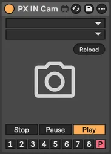
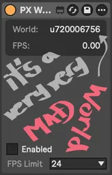
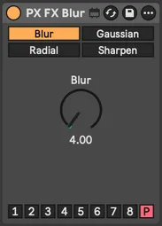
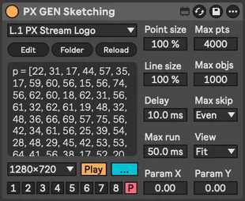
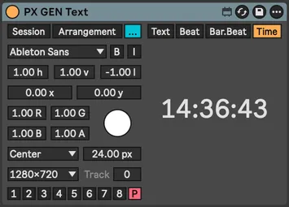
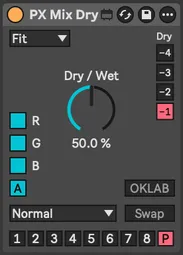
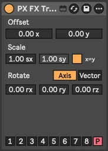
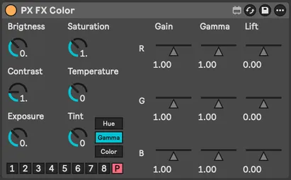
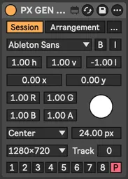
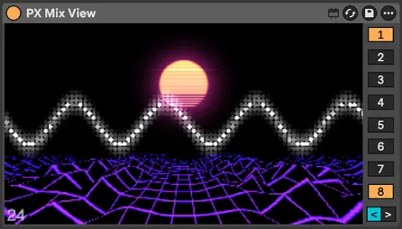

# PX Stream

⚠️ Work in progress. Not ready for use. Stay tuned.

> PX Stream is a visual performance toolkit for [Max for Live](https://www.ableton.com/en/live/max-for-live/),
> featuring audio-reactive [Interactive Shader Format](https://www.interactiveshaderformat.com/) visuals,
> text rendering and [Syphon](https://syphon.info/) output streaming

<!-- begin: collage -->

    
    
    
    
    
    
    
    
    
    
    
    
    
    
    
    
    
    
    
    
    
    
    
    
    
    
    
    
    
    
    
    
    
    
    
    
    
    
    

<!-- end: collage -->

 

- [Guides](#guides)
    - [Install](#install)
    - [Minimal patch](#minimal-patch)
    - [Concept basics: Chain, Channel, Mix](#concept-basics-chain-channel-mix)
    - [Extending patch](#extending-patch)
    - [Dry/Wet](#drywet)
    - [Transitions](#transitions)
    - [Automation](#automation)
- [Devices](#devices)
- [Alternatives](#alternatives)
- [License](#license)

 

## Guides

### Install

TBD

### Minimal patch

TBD

### Concept basics: Chain, Channel, Mix

TBD

### Extending patch

TBD

### Dry/Wet

TBD

### Transitions

TBD

### Automation

TBD

## Devices

<table>
  <tr>
    <th align="left">PX Core</th>
    <th align="left">IN (inputs)</th>
    <th align="left">GEN (generators)</th>
    <th align="left">FX (effects)</th>
    <th align="left">DEV (utilities)</th>
  </tr>
    <td valign="top">
        <a href="#px-world">World</a> 
        <a href="#px-mix-view">Mix View</a> 
        <a href="#px-mix_channel">Mix Channel</a> 
        <a href="#px-mix-dry">Mix Dry</a> 
        <a href="#px-mix-transition">Mix Transition</a> 
        <a href="#px-rec">Rec</a> 
        

        <a href="#px-route-audio">Route Audio</a> 
        <a href="#px-route-midi">Route MIDI</a> 
        

        <a href="#px-shader">Shader</a>
    </td>
    <td valign="top">
        <a href="#in-cam">IN Cam</a> 
        <a href="#in-syphon">IN Syphon</a> 
        

        <a href="#in-image">IN Image</a> 
        <a href="#in-video">IN Video</a> 
        <a href="#in-svg">IN SVG</a> 
        

        <a href="#in-channel">IN Channel</a> 
        <a href="#in-mix">IN Mix</a> 
    </td>
    <td valign="top">
        <a href="#gen-cos-pattern">GEN Cos Pattern</a> 
        <a href="#gen-mini-shader">GEN Mini Shader</a> 
        <a href="#gen-sketching">GEN Sketching</a> 
        <a href="#gen-text">GEN Text</a> 
    </td>
    <td valign="top">
        <a href="#fx-alpha">FX Alpha</a> 
        <a href="#fx-blur">FX Blur</a> 
        <a href="#fx-color">FX Color</a> 
        <a href="#fx-colorize">FX Colorize</a> 
        <a href="#fx-convert">FX Convert</a> 
        <a href="#fx-delay">FX Delay</a> 
        <a href="#fx-kaleidoscope">FX Kaleidoscope</a> 
        <a href="#fx-pass">FX Pass</a> 
        <a href="#fx-pixelization">FX Pixelization</a> 
        <a href="#fx-transform">FX Transform</a>
    </td>
    <td valign="top">
        <a href="#dev-info">DEV Info</a> 
        <a href="#dev-console">DEV Console</a>
    </td>
  </tr>
</table>

### PX World

Essential rendering context. You need exactly one per Live set. More would be problematic. Sets target FPS. FPS 0 will use available maximum with displaylink turned on on Mac.

 

### PX Mix View

Multi-channel mixing and preview. Mix output selected in expanded section can be consumed by [IN Mix](#in-mix) device and [Syphon](https://syphon.info/) clients. Click preview for floating window, <kbd>ESC</kbd> for fullscreen on/off.

 

### PX Mix Channel

Send texture to selected channel. Alternative to individual channel selectors on each device.

### PX Mix Dry

Dry/wet mix from two previous devices. Select which (-1 to -4) for dry signal. Multiple blend modes and signal swap. Swap has no effect on [commutative](https://en.wikipedia.org/wiki/Commutative_property) blending methods.

### PX Mix Transition

Transition between two previous devices. Channel selection same as Mix Dry. Uses 90+ transitions from [gl-transitions.com](https://gl-transitions.com/).

### PX Rec

Video recording and screenshotting

---

### PX Route Audio

Route audio from any track in your Live set

### PX Route MIDI

Send MIDI from selected track to next device. Works with [PX Shader](#px-shader) device and MIDI-enabled shaders.

---

### PX Shader

Interactive Shader Format ([ISF](https://isf.video/)) host for generators and effects. Up to 32 dynamic parameters and various audio rendering options with our custom audio types.

 

#### Audio types

|      | Name       | Type     | Description                                                                                                                                                                                           |
|------|------------|----------|-------------------------------------------------------------------------------------------------------------------------------------------------------------------------------------------------------|
| WAVE | waveImage  | audio    | standard ISF, channel per image row                                                                                                                                                                   |
| WAVU | wavuImage  | audio    | channel per image color, Red = Left, Green = Right                                                                                                                                                    |
| FFT  | fftImage   | audiofft | standard ISF, channel per image row                                                                                                                                                                   |
| FFTU | fftuImage  | audiofft | channel per image color                                                                                                                                                                               |
| XY   | xyImage    | audio    | X = Left, Y = Right, dots                                                                                                                                                                             |
| XYC  | xycImage   | audio    | X = Left, Y = Right, connected lines                                                                                                                                                                  |
| XYD  | xydImage   | audio    | X = Left, Y = Right, skipping distant lines                                                                                                                                                           |
| XYE  | xyeImage   | audio    | [electron beam emulation](https://m1el.github.io/woscope-how/), ported to Jitter shader by Rob Ramirez [here](https://discord.com/channels/289378508247924738/351004699811512322/1407790819183956109) |
| MIDI | midiImage  | audio    | X = (R: note/velocity, G: CC number/value), Y = MIDI channel                                                                                                                                          |
| IN   | inputImage | image    | automatic, from previous device in the chain                                                                                                                                                          |

#### Shader categories

- C. Colorful
- F. FFT Spectrogram
- G. Generator
- L. LED
- M. MIDI
- S. Scenes
- T. Transformation
- U. Utility
- W. Waveforms
- X. XY Oscilloscopes
- ~. Test Shaders

---

### IN Cam

Live input from connected video devices

### IN Syphon

[Syphon](https://syphon.info/) input for sharing visuals between applications. Mac only.

---

### IN Image

Static image input. Supports JPG, WEBP and PNG formats.

### IN SVG

Vector graphics input with resolution-independent scaling SVG file formal

### IN Video

Video playback. Supports MP4, AVI, MOV (including [HAP codecs](https://hap.video/)).

---

### IN Channel

Use texture from [Mix Channel](#px-mix-channel) as input. Creates feedback when combined with [Mix Dry](#px-mix-dry) on same channel.

### IN Mix

Use channel mix from [Mix View](#px-mix-view) device as input texture.

---

### GEN Cos Pattern

Procedural patterns with cosine palettes [popularized](https://iquilezles.org/articles/palettes/) by Inigo Quilez

 

### GEN Mini Shader

Shaders in [twigl.app](https://twigl.app/) `geekest (300 es)` format.

 

#### Shader files

`GLSL` files are stored in `data/mini-shaders` folder. Temporary JXS files is stored under `data/mini-shaders/.temp.jxs`.

#### Shader categories

| Type | Description           |
|------|-----------------------|
| B.   | Shaders from Blue Sky |
| T.   | Shaders from Twitter  |
| X.   | Examples              |

Learn more about the [Modeling the World in 280 Characters](https://tympanus.net/codrops/2025/06/23/modeling-the-world-in-280-characters/).

#### Variables

| Name | Type      | Description  |
|------|-----------|--------------|
| FC   | vec4      | gl_FragCoord |
| r    | vec2      | resolution   |
| m    | vec2      | mouse        |
| t    | float     | time         |
| f    | float     | frame        |
| b    | sampler2D | backbuffer   |
| o    | vec4      | output       |

#### Utilities

Included when needed.

- F4
- mod289
- permute
- taylorInvSqrt
- snoise2D
- snoise3D
- grad4
- snoise4D
- fsnoise
- fsnoiseDigits
- hsv
- rotate2D
- rotate3D
- PI
- PI2
- tanh (`#define tanh(x) tanh(clamp(x, -10.,10.))`)

Learn more in [twigl documentation](https://github.com/doxas/twigl#twigl).

### GEN Sketching

Custom OpenGL primitives scripting with JavaScript, slightly compatible with [openprocessing.org](https://openprocessing.org/)

 

### GEN Text

Text generation from session/clip names, custom text, or dynamic musical data (beat, bar.beat, time)

  

---

### FX Alpha

Alpha channel tools: chroma key, mapping, inversion, smoothing, removal, etc.

### FX Blur

Four blur shaders from Max/Jitter stock collection

### FX Color

Color grading and adjustment tools

  

### FX Colorize

Two/tri tone colorization with multiple mapping methods

### FX Convert

Texture format conversion including OKLAB and normalized OKLAB aka NOKLAB

 

### FX Delay

Frame-based texture delay. Combine with Mix Dry device for ghost trail effects.

### FX Kaleidoscope

Kaleidoscope patterns based on [Brewster designs]((https://en.wikipedia.org/wiki/Kaleidoscope#Different_versions_suggested_by_Brewster)) plus Max/Jitter shader

### FX Pass

Postprocessing shaders from Max/Jitter stock library. See [Max documentation](https://docs.cycling74.com/reference/jit.gl.pass).

### FX Pixelization

Multi-shape pixelization: rectangular, circular, honeycomb, hexagonal, triangular grids

### FX Transform

Geometric transformations: scale, shift, rotation (around axis or vector)

---

### DEV Info

Shows texture info for development purposes

### DEV Console

Enables detailed Max console output for development and debugging. DO NOT USE IN PRODUCTION.

## Alternatives

Max for Live

- [VIZZable 2](https://github.com/zealtv/VIZZable-2) (free)
- [V-Module](https://github.com/j74/V-Module-Max-for-Live-Video-Plugins) (free)
- [Geometrum 02](https://artekniks.gumroad.com/l/geometrum) (free)
- [Zwobot](https://www.zwobotmax.com/)
- [EboSuite](https://www.ebosuite.com/)

Max for Live + App

- [Videosync 2](https://videosync.showsync.com/)

VST

- [VS - Visual Synthesizer](https://www.imaginando.pt/products/vs-visual-synthesizer)

## License

This project is dual-licensed under [MIT or CC-BY](./LICENSE) (your choice).

You may use, modify, and distribute this work under either license.

For dynamically loaded assets licensing see [assets/LICENSE.md](./assets/LICENSE.md)
