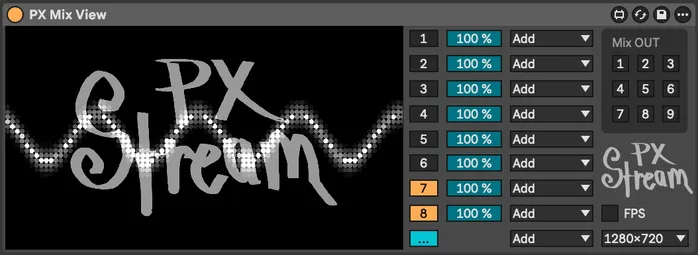
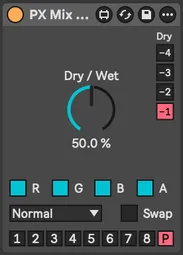
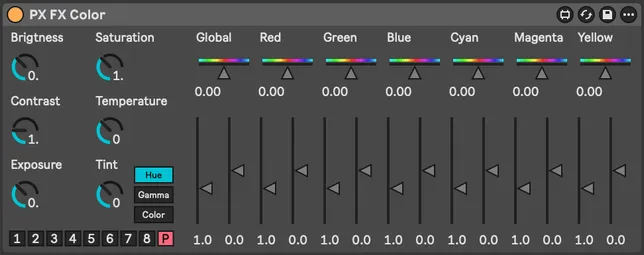
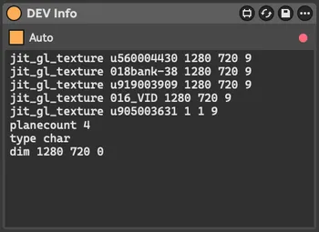
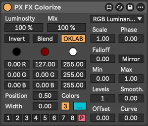
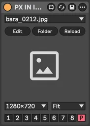
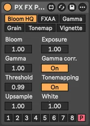

# PX Stream [WIP]

> PX Stream is a visual performance toolkit for [Max for Live](https://www.ableton.com/en/live/max-for-live/),
> featuring audio-reactive [Interactive Shader Format](https://www.interactiveshaderformat.com/) visuals,
> text rendering and [Syphon](https://syphon.info/) output streaming

## Devices

<!-- begin: collage -->
<div>
    <a href="#px-mix-view"></a>
    <a href="#in-video"></a>
    <a href="#in-svg"></a>
    <a href="#gen-text"></a>
    <a href="#fx-convert"></a>
    <a href="#in-mix"></a>
    <a href="#fx-pixelization"></a>
    <a href="#px-shader"></a>
    <a href="#px-mix-transition"></a>
    <a href="#in-syphon"></a>
    <a href="#in-cam"></a>
    <a href="#fx-delay"></a>
    <a href="#px-mix-dry"></a>
    <a href="#fx-color"></a>
    <a href="#px-shader"></a>
    <a href="#fx-alpha"></a>
    <a href="#px-mix-channel"></a>
    <a href="#fx-transform"></a>
    <a href="#fx-convert"></a>
    <a href="#px-route-midi"></a>
    <a href="#dev-info"></a>
    <a href="#fx-color"></a>
    <a href="#fx-color"></a>
    <a href="#px-world"></a>
    <a href="#in-channel"></a>
    <a href="#fx-kaleidoscope"></a>
    <a href="#dev-console"></a>
    <a href="#gen-cos-pattern"></a>
    <a href="#gen-text"></a>
    <a href="#fx-colorize"></a>
    <a href="#px-world"></a>
    <a href="#in-image"></a>
    <a href="#fx-pass"></a>
    <a href="#fx-blur"></a>
    <a href="#px-route-audio"></a>
    <a href="#px-mix-view"></a>
</div>
<!-- end: collage -->

<br>

<table>
  <tr>
    <th align="left">PX Core</th>
    <th align="left">IN (inputs)</th>
    <th align="left">GEN (generators)</th>
    <th align="left">FX (effects)</th>
    <th align="left">DEV (utilities)</th>
  </tr>
    <td valign="top">
        <a href="#px-world">World</a><br>
        <a href="#px-mix-view">Mix View</a><br>
        <a href="#px-mix_channel">Mix Channel</a><br>
        <a href="#px-mix-dry">Mix Dry</a><br>
        <a href="#px-mix-transition">Mix Transition</a><br>
        <hr>
        <a href="#px-route-audio">Route Audio</a><br>
        <a href="#px-route-midi">Route MIDI</a><br>
        <hr>
        <a href="#px-shader">Shader</a>
    </td>
    <td valign="top">
        <a href="#in-cam">IN Cam</a><br>
        <a href="#in-syphon">IN Syphon</a><br>
        <hr>
        <a href="#in-image">IN Image</a><br>
        <a href="#in-video">IN Video</a><br>
        <a href="#in-svg">IN SVG</a><br>
        <hr>
        <a href="#in-channel">IN Channel</a><br>
        <a href="#in-mix">IN Mix</a><br>
    </td>
    <td valign="top">
        <a href="#gen-cos-pattern">GEN Cos Pattern</a><br>
        <a href="#gen-text">GEN Text</a><br>
    </td>
    <td valign="top">
        <a href="#fx-alpha">FX Alpha</a><br>
        <a href="#fx-blur">FX Blur</a><br>
        <a href="#fx-color">FX Color</a><br>
        <a href="#fx-colorize">FX Colorize</a><br>
        <a href="#fx-convert">FX Convert</a><br>
        <a href="#fx-delay">FX Delay</a><br>
        <a href="#fx-kaleidoscope">FX Kaleidoscope</a><br>
        <a href="#fx-pass">FX Pass</a><br>
        <a href="#fx-pixelization">FX Pixelization</a><br>
        <a href="#fx-transform">FX Transform</a>
    </td>
    <td valign="top">
        <a href="#dev-info">DEV Info</a><br>
        <a href="#dev-console">DEV Console</a>
    </td>
  </tr>
</table>

### PX World


### PX Mix View


### PX Mix Channel


### PX Mix Dry


### PX Mix Transition


---

### PX Route Audio


### PX Route MIDI


---

### PX Shader


---

### IN Cam


### IN Syphon


### IN Image


### IN SVG


### IN Video


### IN Channel


### IN Mix


---

### GEN Cos Pattern


### GEN Text


---

### FX Alpha

Various Alpha channel manipulation like Chroma keying, mapping, inverting, smoothing, removing, etc. 


### FX Blur

Four blur Max/Jitter stock blur shaders


### FX Color

Various color grading and adjustments


### FX Colorize

Two/tri tone colorization with various mapping methods


### FX Convert

Texture format conversion, including OKLAB and normalized OKLAB aka NOKLAB


### FX Delay

Texture delay in frames. You can mix it with dry signal using [Mix Dry](#px-mix-dry) device for ghostly trace effect


### FX Kaleidoscope

Various emulation attempts of kaleidoscope layouts [suggested by Brewster](https://en.wikipedia.org/wiki/Kaleidoscope#Different_versions_suggested_by_Brewster) plus one stock Max/Jitter shader


### FX Pass


### FX Pixelization


### FX Transform


---

### DEV Info

Displays texture info


### DEV Console

Enables additional Max console output. DO NOT USE IN PRODUCTION.


## Development

### Prerequisites

- install __"ISF by Vidvox"__ in Max `File > Show Package Manager`
- configure [maxdiff](https://github.com/Ableton/maxdevtools/tree/main/maxdiff)

### Diff

```bash
git --no-pager diff "./*.amxd" "./*.maxpat"
```

### Batch freezing

Requires preparation, see [scripts/freeze.scpt](./scripts/freeze.scpt)

```shell
npm script freeze
```

### Shaders

- shaders loaded from `./shaders` folder near the device
- do not use keywords (like `size`, `float`, `int`, ...) in ISF `NAME` property

### ISF Extensions

|      | Name       | Type     | Description                                                                                                                                                                                           |
|------|------------|----------|-------------------------------------------------------------------------------------------------------------------------------------------------------------------------------------------------------|
| WAVE | waveImage  | audio    | standard ISF, channel per image row                                                                                                                                                                   |
| WAVU | wavuImage  | audio    | channel per image color, Red = Left, Green = Right                                                                                                                                                    |
| FFT  | fftImage   | audiofft | standard ISF, channel per image row                                                                                                                                                                   |
| FFTU | fftuImage  | audiofft | channel per image color                                                                                                                                                                               |
| XY   | xyImage    | audio    | X = Left, Y = Right, dots                                                                                                                                                                             |
| XYC  | xycImage   | audio    | X = Left, Y = Right, connected lines                                                                                                                                                                  |
| XYD  | xydImage   | audio    | X = Left, Y = Right, skipping distant lines                                                                                                                                                           |
| XYE  | xyeImage   | audio    | [electron beam emulation](https://m1el.github.io/woscope-how/), ported to Jitter shader by Rob Ramirez [here](https://discord.com/channels/289378508247924738/351004699811512322/1407790819183956109) |
| MIDI | midiImage  | audio    | X = (R: note/velocity, G: CC number/value), Y = MIDI channel                                                                                                                                          |
| IN   | inputImage | image    | automatic, from previous device in the chain                                                                                                                                                          |

## Shaders [TBD]

### C. Colorful

### F. FFT Spectrogram

### G. Generator

### L. LED

### M. MIDI

### S. Scenes

### T. Transformation

### U. Utility

### W. Waveforms

### X. XY Oscilloscopes

### ~. Test Shaders

## Alternatives

- [VIZZable 2](https://github.com/zealtv/VIZZable-2) (free)
- [Geometrum 02](https://artekniks.gumroad.com/l/geometrum) (free)
- [Videosync 2](https://videosync.showsync.com/)
- [EboSuite](https://www.ebosuite.com/)
- [VS - Visual Synthesizer](https://www.imaginando.pt/products/vs-visual-synthesizer)
- [Zwobot](https://www.zwobotmax.com/)
