# PX Stream

⚠️ `WARNING` Work in progress. Not ready for use. Stay tuned.

  

> PX Stream is a visual performance toolkit of 30+ compact devices for [Max for Live](https://www.ableton.com/en/live/max-for-live/), featuring:
> - audio and MIDI-reactive extended [Interactive Shader Format](https://www.interactiveshaderformat.com/) visuals
> - multichannel mixing and routing system
> - effects, generators, and utilities
> - 90+ transitions
> - text rendering
> - [Syphon](https://syphon.info/)/[Spout](https://spout.zeal.co/) output streaming
> - user-editable ISF shaders, mini shaders, GL sketches and transitions

  

<!-- begin: collage -->

    <a href="#px-mix-view">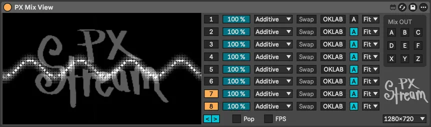</a>
    <a href="#fx-pixelization">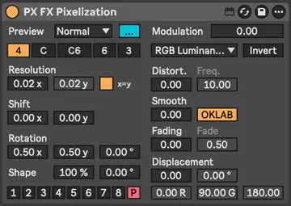</a>
    <a href="#px-route-audio">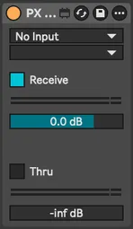</a>
    
    
    <a href="#dev-console">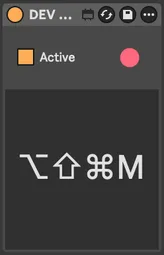</a>
    <a href="#px-shader">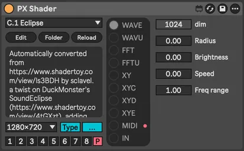</a>
    
    
    
    
    
    <a href="#px-world">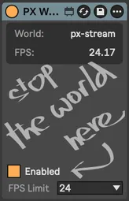</a>
    
    
    
    <a href="#fx-alpha">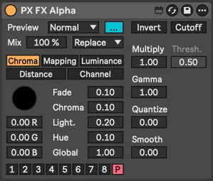</a>
    
    
    
    
    <a href="#in-video">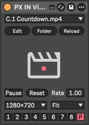</a>
    <a href="#fx-colorize">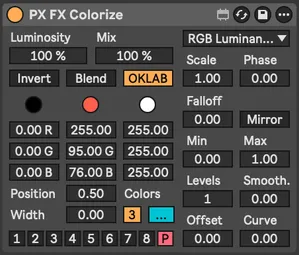</a>
    <a href="#fx-color">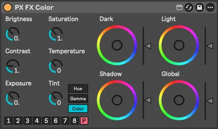</a>
    
    
    
    
    <a href="#fx-convert">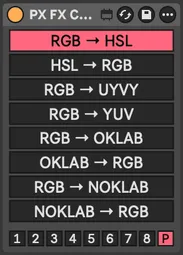</a>
    <a href="#in-mix">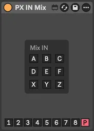</a>
    <a href="#gen-cos-pattern">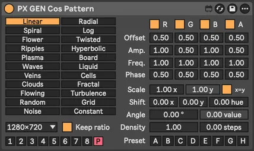</a>
    
    
    
    
    
    
    
    

<!-- end: collage -->

 

- [Install](#install)
- [Troubleshooting and feedback](#troubleshooting-and-feedback)
- [Guide](#guide)
    - [Minimal patch](#guide--minimal-patch)
    - [Adding FX](#guide--adding-fx)
    - [Using Mix Dry](#guide--using-mix-dry)
    - [Using MIDI](#guide--using-midi)
    - [Using Feedback](#guide--using-feedback)
    - [Using XY Oscilloscope](#guide--using-xy-oscilloscope)
    - [Syphon/Spout streaming](#guide--syphonspout-streaming)
    - [Automation](#guide--automation)
    - [Performance](#guide--performance)
- [Devices](#devices)
- [Alternatives](#alternatives)
- [Roadmap](#roadmap)
- [License](#license)

 

## Install

0. Prerequisites: _Ableton Live 12.2 Suite_ or _Ableton Live 12.2 Standard with Max for Live_
1. Download the latest [release](https://github.com/darosh/px-stream/releases)
2. Follow official instructions on [Using third-party Packs](https://help.ableton.com/hc/en-us/articles/206471044-Using-third-party-Packs)

### Windows specific additional installation steps

Windows users need to install two additional Max packages (VIDDLL and [ISF](https://cycling74.com/packages/isf)) in the [package manager](https://docs.cycling74.com/userguide/package_manager/)

Open the package manager:

1. Open the [...] menu on a max device, for example `PX World`, and click `Edit in Max`
2. In Max > `File` menu, click `Show Package Manager`

In Max package manager:

4. Select `Remote packages` and search for the package `VIDDLL`
5. Open the package and click install
6. Repeat step **4** for the `ISF` package
7. Restart Live

Optimization (may help some Windows 11 users):

8. Windows Settings -> System -> Display -> Graphics -> Ableton:
   - GPU Preference = High performance, 
   - Optimization for windowed games = On
9. Restart computer
10. Check used renderer in Max -> Options -> OpenGL Status

 

## Troubleshooting and feedback

- File an [issue](https://github.com/darosh/px-stream/issues) or vote on an existing one
- Join the [PX Stream Discord Server](https://discord.gg/de5txQSven) and share your videos, shaders, presets and thoughts.

 

## Guide

The first 5 guides are available as Live sessions in the `/Demo` folder of the installed pack

### Guide &mdash; Minimal patch

1. Insert [PX World](#px-world) device. Exactly one `World` device is needed per Live set.
2. Insert [PX Mix View](#px-mix-view) device
3. Insert [GEN Mini Shader](#gen-mini-shader) device
4. Select channel number **1** in the `channel selector` at the bottom of the last inserted device

✨ `TIP` All devices start with PX, so you can quickly select a device with the sequence <kbd>Command+F</kbd> + `px wo` + <kbd>Down</kbd> + <kbd>Enter</kbd>

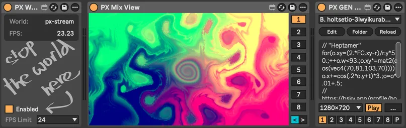

 

### Guide &mdash; Adding FX

1. Select **P** (Pass) in the `channel selector` in the `GEN Mini Shader` device from the previous guide
2. Insert [FX Kaleidoscope](#fx-kaleidoscope) device
3. Insert [PX Mix Channel](#px-mix-channel) device
4. Select **1** in the `channel selector` at the bottom of the last inserted device
5. Adjust FX Kaleidoscope parameters as you like

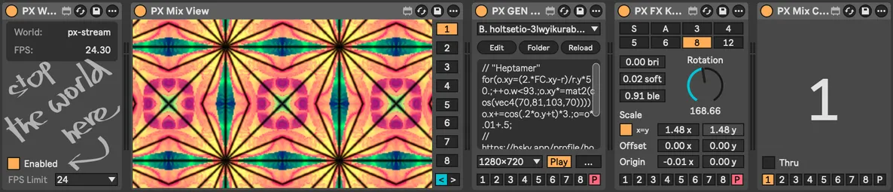

 

### Guide &mdash; Using Mix Dry

1. Insert [IN SVG](#in-svg) device before the `Mix Channel` device and select `PX Stream logo`
2. Insert [PX Mix Dry](#px-mix-dry) before the `Mix Channel` device
3. Experiment with parameters in the `Mix Dry` device

✨ `TIP` `Dry` selector **-1** to **-4** in the `PX Mix Dry` device selects which of the previous devices is used as the _dry_ one

✨ `TIP` With [PX Mix Channel](#px-mix-channel) and [PX Mix Dry](#px-mix-dry), you can create complex multichannel non-linear processing structures in a single track

📒 `NOTE` Tracks and groups have no effect on rendering. The only thing that is taken into account is the order of devices across the whole Live set.

✨ `TIP` Replace the `Mix Dry` device with [PX Mix Transition](#px-mix-transition) and try experimenting with that

 

### Guide &mdash; Using MIDI

1. Insert [Route MIDI](#px-route-midi) device before [PX Shader](#px-shader)
2. Select a MIDI source. Expand `Types` on the Shader device - you should see incoming MIDI signal dot indicators blinking on both devices as shown in the screenshot below.
3. Select a MIDI-powered shader (name begins with M.1, M.2, ...)

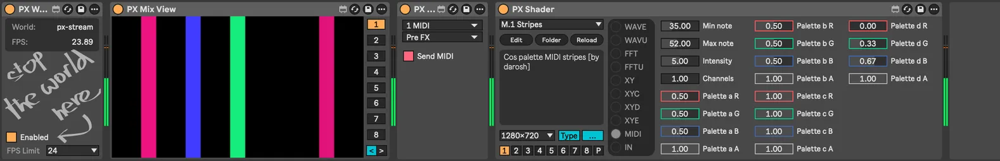

 

### Guide &mdash; Using Feedback

1. Add a one-frame delayed signal using [IN Channel](#in-channel) with the same channel number to the chain
2. Mix the delayed and original signals with the [Mix Dry](#px-mix-dry) device
3. Insert effects between devices like [FX Blur](#fx-blur) and [FX Color](#fx-color) or [FX Transform](#fx-transform) to add more movement

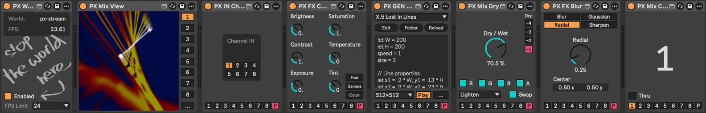

 

### Guide &mdash; Using XY Oscilloscope

1. Pick XY sound source (we used [this one](https://youtu.be/qnL40CbuodU?t=27) for animation bellow)
2. Insert [PX Shader](#px-shader) and select an XY shader (those begin with X.1, X.2, ...)
3. Add some [FX Pass](#fx-pass) bloom goodness

 

### Guide &mdash; Syphon/Spout streaming

1. Expand the [PX Mix View](#px-mix-view) device using the `[...]` button
2. Select Mix OUT channel number **1** &mdash; this will allow you to select the stream in a Syphon (Mac) or Spout (Windows) client as `[Live] PX Stream 1`

📒 `NOTE` `Mix OUT` has dual purpose, not only it turns the Syphon/Spout output on, but it also can be consumed with the [IN Mix](#in-mix) device for further (post)processing

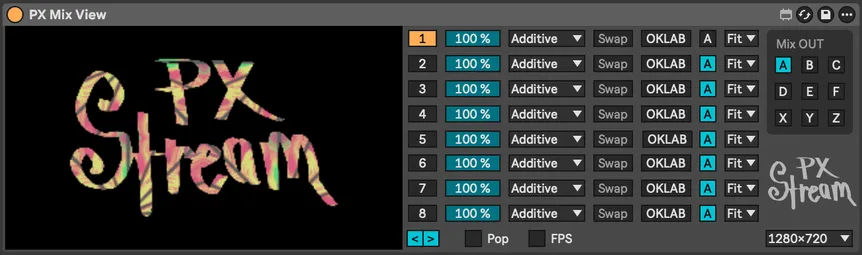

 

### Guide &mdash; Automation

Most of the parameters in the toolkit can be [automated in the standard way](https://www.ableton.com/en/manual/automation-and-editing-envelopes/) with a few exceptions:

- **File and font menus** in devices loading dynamic assets operate on two ways
  1. when you only select a single value without automation, the session will restore the value based on the selected name
  2. when you automate, for example the `File / File Automation` parameter in [IN SVG](#in-svg), the automation is based on the order of items and will break if you change the content of the loaded folder, for example `Assets/svg`
- **Cam and Stream (Syphon/Spout)** input selection cannot be automated
- **Color wheels** in [FX Color](#fx-color) &mdash; see  🧲 `AUTOMATION` note in the device documentation

 

### Guide &mdash; Performance

- Devices and assets are designed to be mostly lightweight and run at 60 to 120 FPS on a MacBook M1 Pro.
- Power status, energy saving options and floating/fullscreen preview window status may affect real FPS.
- Most of the processing is done with OpenGL on the GPU, so it should not affect Ableton's CPU-based sound processing.
- Optimizing resources loaded from assets is recommended: smaller dimensions for images and smaller format (WEBP), and smaller dimensions and CPU-friendly codec (HAP) for videos
- Some devices, especially postprocessing ones like [FX Pass](#fx-pass), are better to use only once &mdash; before the final output
- Some devices, especially [GEN Sketching](#gen-sketching), seem to have noticeably worse performance on Windows

✨ `TIP` To guess the impact of a device on performance, select 0 FPS in [PX World](#px-world) and turn on the `Show FPS` switch in the extended (`[...]` button) [PX Mix View](#px-mix-view) device

✨ `TIP` If you notice a significant drop in performance, don't use the effect (or embrace the glitch goodness), or sample parts of the performance to video &mdash; there is the [PX Rec](#px-rec) recording device or instant video sampling hotkeys in the [Mix View](#px-mix-view) device available.

 

## Devices

<table>
  <tr>
    <th align="left">PX Core</th>
    <th align="left">IN (inputs)</th>
    <th align="left">GEN (generators)</th>
    <th align="left">FX (effects)</th>
    <th align="left">DEV (utilities)</th>
  </tr>
    <td valign="top">
        <a href="#px-world">World</a> 
        <a href="#px-mix-view">Mix View</a> 
        <a href="#px-mix_channel">Mix Channel</a> 
        <a href="#px-mix-dry">Mix Dry</a> 
        <a href="#px-mix-transition">Mix Transition</a> 
        <a href="#px-rec">Rec</a> 
        

        <a href="#px-route-audio">Route Audio</a> 
        <a href="#px-route-midi">Route MIDI</a> 
        

        <a href="#px-shader">Shader</a>
    </td>
    <td valign="top">
        <a href="#in-cam">IN Cam</a> 
        <a href="#in-stream">IN Stream</a> 
        

        <a href="#in-image">IN Image</a> 
        <a href="#in-video">IN Video</a> 
        <a href="#in-svg">IN SVG</a> 
        

        <a href="#in-channel">IN Channel</a> 
        <a href="#in-mix">IN Mix</a> 
    </td>
    <td valign="top">
        <a href="#gen-cos-pattern">GEN Cos Pattern</a> 
        <a href="#gen-mini-shader">GEN Mini Shader</a> 
        <a href="#gen-sketching">GEN Sketching</a> 
        <a href="#gen-text">GEN Text</a> 
    </td>
    <td valign="top">
        <a href="#fx-alpha">FX Alpha</a> 
        <a href="#fx-blur">FX Blur</a> 
        <a href="#fx-color">FX Color</a> 
        <a href="#fx-colorize">FX Colorize</a> 
        <a href="#fx-convert">FX Convert</a> 
        <a href="#fx-delay">FX Delay</a> 
        <a href="#fx-kaleidoscope">FX Kaleidoscope</a> 
        <a href="#fx-pass">FX Pass</a> 
        <a href="#fx-pixelization">FX Pixelization</a> 
        <a href="#fx-transform">FX Transform</a>
    </td>
    <td valign="top">
        <a href="#dev-info">DEV Info</a> 
        <a href="#dev-console">DEV Console</a>
    </td>
  </tr>
</table>

 

### PX World

Essential rendering context. You need exactly one per Live set. More would be mad.

 

✨ `TIP` `Enable` parameter turns off all rendering completely (disabling the device does the same)

📒 `NOTE` Mac only: `FPS` parameter set to **0** will use the maximum available FPS with `displaylink` turned on. On Windows this has no effect.

 

---
 

### PX Mix View

Multichannel mixing, preview and stream output

  

✨ `TIP` Mix output selected in expanded section can be consumed by [IN Mix](#in-mix) device and [Syphon](https://syphon.info/) or [Spout](https://spout.zeal.co/) clients.

✨ `TIP` Click on preview to open floating window with fullscreen option and channel toggle buttons

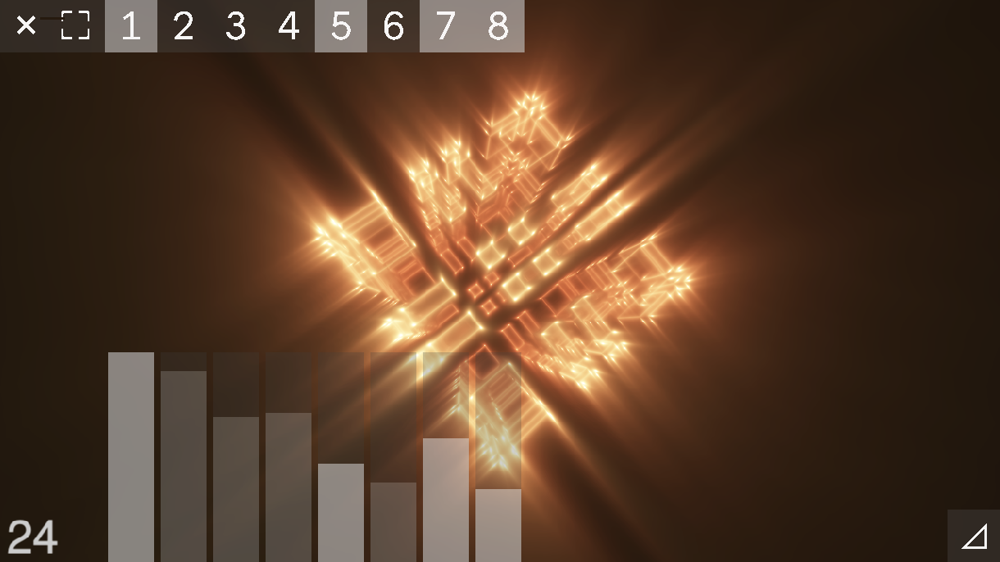

✨ `TIP` On Mac the floating window is hidden when Live is out of focus. You can use this fork of [Simple-Syphon-Client](https://github.com/darosh/Simple-Syphon-Client) modified to be always on top &mdash; see [Syphon/Spout streaming](#guide--syphonspout-streaming) guide.

✨ `TIP` Use Live key mapping on `Pop` toggle for quick show/hide

📒 `NOTE` You can use as many `Mix View` devices as you want, including their popup windows. 

📒 `NOTE` The preview inside the device is limited to 25 accelerated FPS on Mac and on Windows to non-accelerated 12.5 FPS.

📒 `NOTE` Preview inside device is rendered only when the track is active and the device is not collapsed to save resources, so you may see a glitch when switching back to that track.

🧪 `DEV_NOTE` Do we want solo buttons in the floating window? And the mixer faders? And smooth fade in/out?

🧪 `DEV_NOTE` We could add something like PX Mix (without the View part, just the mix, stream and pop)

 

#### PX Mix View &mdash; Hotkeys

- <kbd>Shift+Click</kbd> for instant screenshot stored in `Assets/images`. It will be available in [IN Image](#in-image) device as a PNG file.
- <kbd>Control+Click</kbd> for instant video recording (while holding the mouse button) stored in `Assets/video`, encoded with `h264` codec. It will be available in [IN Video](#in-video) device as a MOV file. For more options and automation, use [PX Rec](#px-rec) device instead.

 

---
 

### PX Mix Channel

Send texture to selected channel. Alternative to individual channel selectors on each device.

 

---
 

### PX Mix Dry

Dry/wet mix from two previous devices

 

✨ `TIP` `Dry` parameter selects which of the previous devices (-1 to -4) is used as dry signal

✨ `TIP` With [PX Mix Channel](#px-mix-channel) and [PX Mix Dry](#px-mix-dry) you can create complex multichannel non-linear processing structures in a single track

📒 `NOTE` `Swap` parameter has no effect on [commutative](https://en.wikipedia.org/wiki/Commutative_property) blending methods

 

---
 

### PX Mix Transition

Transition between two previous devices powered by 90+ transitions from [gl-transitions.com](https://gl-transitions.com/)

 

📒 `NOTE` `From` selection works the same way as the `Dry` parameter in [Mix Dry](#px-mix-dry) device

✨ `TIP` Transitions are user editable shaders in [JXS file format](https://docs.cycling74.com/userguide/jitter/jxs_file_format/) and some of them include additional parameters. For example `Angular.jxs` has `<param name="startingAngle" type="float" default="90"/>` where you can adjust the default value.

 

---
 

### PX Rec

Video recording and screenshotting

📒 `NOTE` On Windows the only supported video codec is `h264`. On Mac there are additionally `prores4444` and `prores442` available.

✨ `TIP` Recorded files are stored under `Assets/video` as MOV files and directly available in [IN Video](#in-video) device. Screenshots are PNG files in `Assets/images` and available in [IN Image](#in-image) device.

 

---
 

### PX Route Audio

Route audio from any track in the Live set

 

---
 

### PX Route MIDI

Send MIDI from selected track to next device

📒 `NOTE` Works only with [PX Shader](#px-shader) device and MIDI-enabled shaders. See the [Using MIDI](#guide--using-midi) guide.

 

---
 

### PX Shader

Interactive Shader Format ([ISF](https://isf.video/)) host for generators and effects

   

Up to 32 dynamic parameters and various audio rendering options with PX Stream specific audio/MIDI input types.

🧲 `AUTOMATION` To automate selected shader file find `File` / `File Automation` parameter in automation lane

✨ `TIP` To reset a shader parameter to its default value, click the parameter label

📒 `NOTE` Due to the dynamic nature of parameter controls, the underlying parameter slider uses a range of 0 to 10, and has invisible text with a scaled value placed on top of that &mdash; which unfortunately makes typing in values pretty suboptimal.

 

#### PX Shader &mdash; Audio types

|      | Name       | Type     | Description                                                                                                                                                                                           |
|------|------------|----------|-------------------------------------------------------------------------------------------------------------------------------------------------------------------------------------------------------|
| WAVE | waveImage  | audio    | standard ISF, channel per image row                                                                                                                                                                   |
| WAVU | wavuImage  | audio    | channel per image color, Red = Left, Green = Right                                                                                                                                                    |
| FFT  | fftImage   | audiofft | standard ISF, channel per image row                                                                                                                                                                   |
| FFTU | fftuImage  | audiofft | channel per image color                                                                                                                                                                               |
| XY   | xyImage    | audio    | X = Left, Y = Right, dots                                                                                                                                                                             |
| XYC  | xycImage   | audio    | X = Left, Y = Right, connected lines                                                                                                                                                                  |
| XYD  | xydImage   | audio    | X = Left, Y = Right, skipping distant lines                                                                                                                                                           |
| XYE  | xyeImage   | audio    | [electron beam emulation](https://m1el.github.io/woscope-how/), ported to Jitter shader by Rob Ramirez [here](https://discord.com/channels/289378508247924738/351004699811512322/1407790819183956109) |
| MIDI | midiImage  | audio    | R: [x, y, value] = [note, channel, velocity], G: [x, y, value] = [CC number, channel, value], B: [x, y, value] = [0, 0, voices], [voice, 0, note]                                               |
| IN   | inputImage | image    | automatic, from previous device in the chain                                                                                                                                                          |

 

---
 

### IN Cam

Live input from connected video devices

 

---
 

### IN Stream

[Syphon](https://syphon.info/) or [Spout](https://spout.zeal.co/) input for sharing visuals between applications.

 

 

---
 

### IN Image

Image input. Supports JPG, WEBP and PNG formats.

 

🧲 `AUTOMATION` To automate selected image file find `File` / `File Automation` parameter in automation lane

 

---
 

### IN SVG

Vector graphics input with resolution-independent scaling in SVG file format

 

🧲 `AUTOMATION` To automate selected SVG file find `File` / `File Automation` parameter in automation lane

📒 `NOTE` SVG internal dimensions must be whole numbers to fully fit into the screen.

✨ `TIP`  There is free [Inkscape](https://inkscape.org/) SVG editor available

 

---
 

### IN Video

Video playback. Supports MP4, AVI, MOV (including [HAP codecs](https://hap.video/)).

 

🧲 `AUTOMATION` To automate selected video file find `File` / `File Automation` parameter in automation lane

 

---
 

### IN Channel

Use texture from [Mix Channel](#px-mix-channel) as input

✨ `TIP` Creates feedback when combined with [Mix Dry](#px-mix-dry) on the same channel. See [Using Feedback](#guide--using-feedback) guide.

 

---
 

### IN Mix

Use channel mix from [Mix View](#px-mix-view) device as input texture.

 

---
 

### GEN Cos Pattern

Procedural patterns with cosine palettes [popularized](https://iquilezles.org/articles/palettes/) by Inigo Quilez

 

 

---
 

### GEN Mini Shader

Shaders in [twigl.app](https://twigl.app/) `geekest (300 es)` format.

 

✨ `TIP` To use real time, set `Offset` parameter to **−1&nbsp;ms**

🧲 `AUTOMATION` To automate selected mini shader find `File` / `File Automation` parameter in automation lane

 

#### GEN Mini Shader &mdash; Shader files

`GLSL` files are stored in the `data/mini-shaders` folder. Temporary JXS files are stored under `data/mini-shaders/.temp.jxs`.

Learn more about [Modeling the World in 280 Characters](https://tympanus.net/codrops/2025/06/23/modeling-the-world-in-280-characters/).

 

#### GEN Mini Shader &mdash; Variables

| Name | Type      | Description         |
|------|-----------|---------------------|
| FC   | vec4      | gl_FragCoord        |
| r    | vec2      | resolution          |
| m    | vec2      | mouse               |
| t    | float     | time                |
| f    | float     | frame               |
| b    | sampler2D | backbuffer (unused) |
| o    | vec4      | output              |

 

#### GEN Mini Shader &mdash; Utilities

Dynamically included when referenced in mini shader GLSL.

- **Noise**: `F4`, `mod289`, `permute`, `taylorInvSqrt`, `snoise2D`, `snoise3D`, `grad4`, `snoise4D`, `fsnoise`, `fsnoiseDigits`
- **Color**: `hsv`
- **Rotation**: `rotate2D`, `rotate3D`
- **Constants**: `PI`, `PI2`
- **Compatibility**: `tanh` (`#define tanh(x) tanh(clamp(x, -10.,10.))`)

Learn more in [twigl documentation](https://github.com/doxas/twigl#twigl).

 

---
 

### GEN Sketching

Custom OpenGL primitives scripting with JavaScript, slightly compatible with [openprocessing.org](https://openprocessing.org/)

 

🧲 `AUTOMATION` To automate selected sketch find `File` / `File Automation` parameter in automation lane

🧪 `DEV_NOTE` This device is very limited, and due to the underlying tech `JS`/`jit.gl.sketch`, it will likely develop into its own thing rather than a processing.js compatible environment

 

---
 

### GEN Text

Text generation from session/clip names, custom text, or dynamic musical data (beat, bar.beat, time)

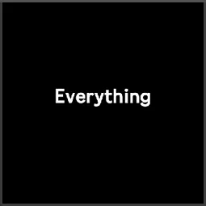  

📒 `NOTE` Arrangement clip text is cached. In order to refresh the cache, disable and enable the device (or switch mode to `Session` and back).

🧲 `AUTOMATION` To automate selected font find `Font` / `Font Automation` parameter in automation lane

 

---
 

### FX Alpha

Alpha channel tools: chroma key, mapping, inversion, smoothing, removal, etc.

 

 

---
 

### FX Blur

Four blur Max/Jitter stock shaders

 

 

---
 

### FX Color

Color grading and adjustment tools

    

🧲 `AUTOMATION` For color wheel automation, find `Dark X`, `Dark Y`, `Light X`, ... parameters in automation lane

✨ `TIP` To reset a color wheel to its default value, click its label (`Dark`, `Light`, ...)

 

---
 

### FX Colorize

Two/tri tone colorization with various mapping methods

 

 

---
 

### FX Convert

Texture format conversion including OKLAB and normalized OKLAB aka NOKLAB

 

✨ `TIP` To get even weirder colors, use two `FX Convert` devices with different formats

 

---
 

### FX Delay

Frame-based texture delay

 

✨ `TIP` To see the dry and delayed signals at the same time, put a [Mix Dry](#px-mix-dry) device after the delay one

 

---
 

### FX Kaleidoscope

Kaleidoscope patterns based on [Brewster designs](https://en.wikipedia.org/wiki/Kaleidoscope#Different_versions_suggested_by_Brewster) plus one stock Max/Jitter shader

 

 

---
 

### FX Pass

Postprocessing shaders from Max/Jitter library. See [Max documentation](https://docs.cycling74.com/reference/jit.gl.pass).

 

✨ `TIP` Everything looks better with Bloom effect, especially if you are into the neon glowing aesthetics.

✨ `TIP` To adjust the Bloom effect, find the right `Threshold` first and then set the `Bloom` amount

 

---
 

### FX Pixelization

Multi-shape pixelization: rectangular, circular, honeycomb, hexagonal, triangular grids

 

✨ `TIP` To make gaps between pixels, lower the `Shape %` value

✨ `TIP` To make the image less pixelated, adjust the `Smooth` parameter

✨ `TIP` For an LED-like glowing effect, use `Fading`

 

---
 

### FX Transform

Geometric transformations: scale, shift, rotation (around axis or vector)

 

 

---
 

### DEV Info

Shows texture, channel and chain info for development purposes

 

---
 

### DEV Console

Enables detailed Max console output for development and debugging. ⚠ DO NOT USE IN PRODUCTION!

 

## Alternatives

Max for Live

- [VIZZable 2](https://github.com/zealtv/VIZZable-2) (free)
- [V-Module](https://github.com/j74/V-Module-Max-for-Live-Video-Plugins) (free)
- [Geometrum 02](https://artekniks.gumroad.com/l/geometrum) (free)
- [Zwobot](https://www.zwobotmax.com/)
- [EboSuite](https://www.ebosuite.com/)

Max for Live + Companion App

- [Videosync 2](https://videosync.showsync.com/)

Plugin / Standalone App 

- [VS - Visual Synthesizer](https://www.imaginando.pt/products/vs-visual-synthesizer)

 

## Roadmap

- alpha testing (volunteers needed)
- more shaders, presets
- beta testing (public)
- more shaders, presets
- example demo track
- 1.0 release
- gumroad for donations?
- more shaders, presets
- 2.0?
  - simple/instant audio/MIDI based modulation
  - geometry/scene based devices?
  - more GENs, FXs, shaders, presets
  - device template / SDK, dev doc?

 

## License

This project is dual-licensed under [MIT or CC-BY](./LICENSE) (your choice).

You may use, modify, and distribute this work under either license.

For licensing of dynamically loaded assets, see [assets/LICENSE.md](./assets/LICENSE.md)
